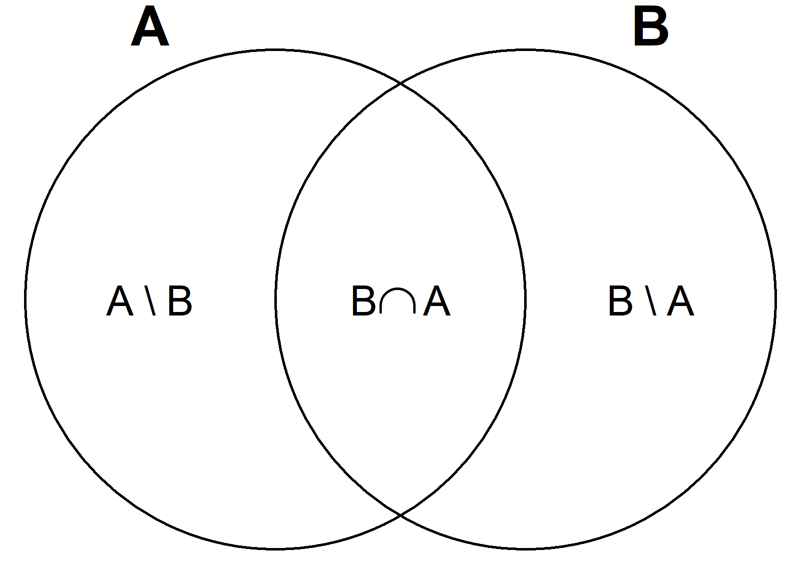

License: `r packageDescription("TMSig")[["License"]]`

```{r setup, include=FALSE}
options(width = 80)
knitr::opts_chunk$set(collapse = TRUE,
                      message = FALSE,
                      comment = "#>",
                      dpi = 400)

suppressPackageStartupMessages({
    library(TMSig)
})
```


# Read GMT Files

GMT files, such as those available through the Molecular Signatures Database
(MSigDB)[@liberzon_molecular_2011; @liberzon_molecular_2015], can be read as
named lists with `readGMT`:

```{r read-gmt}
# Path to GMT file - MSigDB Gene Ontology sets
pathToGMT <- system.file(
    "extdata", "c5.go.v2023.2.Hs.symbols.gmt.gz",
    package = "TMSig"
)

geneSets <- readGMT(path = pathToGMT)

length(geneSets) # 10461 gene sets

head(names(geneSets)) # first 6 gene set names

geneSets[[1]] # genes in first set
```

# Filter Sets

`filterSets` keeps sets that satisfy minimum and maximum size constraints.
Optionally, sets can be restricted to a smaller background of genes before
filtering by size.

```{r filter-sets}
# Filter by size - no background
filt <- filterSets(x = geneSets, 
                   min_size = 10L, 
                   max_size = 500L)
length(filt) # 7096 gene sets remain (down from 10461)
```

Normally, **the background is the genes quantified in a particular
experiment**. For the purposes of this example, the top 2000 most common genes
will be selected to serve as the background. This ensures the gene sets will
maintain some degree of overlap for later steps.

```{r create-background}
# Top 2000 most common genes
topGenes <- table(unlist(geneSets))
topGenes <- head(sort(topGenes, decreasing = TRUE), 2000L)
head(topGenes)

background <- names(topGenes)
```

The gene sets will be restricted to elements of the background before filtering
by size.

```{r filter-sets-bg}
# Restrict genes sets to background of genes
geneSetsFilt <- filterSets(
    x = geneSets, 
    background = background, 
    min_size = 10L # min. overlap of each set with background
)

length(geneSetsFilt) # 4629 gene sets pass
```

The proportion of genes in each set that overlap with the background will be
calculated and used to further select sets.

```{r overlap-prop, fig.cap="Scatterplot of the original set size vs. overlap proportion."}
# Calculate proportion of overlap with background
setSizes <- lengths(geneSetsFilt)
setSizesOld <- lengths(geneSets)[names(geneSetsFilt)]
overlapProp <- setSizes / setSizesOld

plot(setSizesOld, overlapProp, main = "Set Size vs. Overlap")
```

Gene sets with an overlap of at least 70% will be kept, so we can be reasonably
confident that the gene sets are correctly described by their labels. However,
since the background is small, this will remove the majority of sets.

```{r filter-by-overlap}
table(overlapProp >= 0.7)

geneSetsFilt <- geneSetsFilt[overlapProp >= 0.7]
length(geneSetsFilt) # 1015 gene sets pass
```


# Incidence Matrix

An incidence matrix is a representation of a graph. For a named list of sets,
the set names form the rows of the matrix, and all unique elements are columns.
A value of 1 indicates that the element is a member of the set, while a value of
0 indicates otherwise. The incidence matrix forms the basis for many of the
functions in TMSig, including `similarity`, `clusterSets`, `decomposeSets`,
and `cameraPR.matrix`.

```{r incidence-matrix}
imat <- incidence(x = geneSetsFilt)
dim(imat) # 1015 sets, 1914 genes

imat[seq_len(8L), seq_len(5L)] # first 8 sets, first 5 genes
```

The incidence matrix can be used to calculate the sizes of all pairwise set
intersections or the number of sets or pairs of sets to which each gene belongs.

```{r incidence-products}
# Calculate sizes of all pairwise intersections
tcrossprod(imat)[1:3, 1:3] # first 3 gene sets

# Calculate number of sets and pairs of sets to which each gene belongs
crossprod(imat)[1:3, 1:3] # first 3 genes
```


# Set Similarity

The `similarity` function constructs a sparse symmetric matrix of pairwise
Jaccard, overlap/Simpson, or Ōtsuka similarity coefficients for all pairs of
sets $A$ and $B$, where

- Jaccard($A$, $B$) = $\frac{|A \cap B|}{|A \cup B|}$
- Overlap($A$, $B$) = $\frac{|A \cap B|}{\min(|A|, |B|)}$
- Ōtsuka($A$, $B$) = $\frac{|A \cap B|}{\sqrt{|A| \times |B|}}$

All 3 similarity measures can identify aliasing of sets: when two or more sets
contain the same elements, but have different descriptions. Only the
overlap/Simpson similarity can also identify when one set is a subset of
another.


## Jaccard

```{r sim-matrix}
# Jaccard similarity (default)
jaccard <- similarity(x = geneSetsFilt)
dim(jaccard) # 1015 1015`
class(jaccard)
```

The 6 sets having the highest Jaccard similarity with
GOBP_CARDIAC_ATRIUM_DEVELOPMENT are shown for each of the 3 measures of set
similarity.

```{r sim-jaccard}
# 6 sets with highest Jaccard for a specific term
idx <- order(jaccard[, "GOBP_CARDIAC_ATRIUM_DEVELOPMENT"], 
             decreasing = TRUE)
idx <- head(idx)

jaccard[idx, "GOBP_CARDIAC_ATRIUM_DEVELOPMENT", drop = FALSE]
```

GOBP_CARDIAC_ATRIUM_MORPHOGENESIS is highly similar to
GOBP_CARDIAC_ATRIUM_DEVELOPMENT ($J$ = 0.853).


## Overlap/Simpson

```{r sim-simpson}
overlap <- similarity(x = geneSetsFilt, type = "overlap")

overlap[idx, "GOBP_CARDIAC_ATRIUM_DEVELOPMENT", drop = FALSE]
```

GOBP_CARDIAC_ATRIUM_MORPHOGENESIS, GOBP_ATRIAL_SEPTUM_DEVELOPMENT, and
GOBP_ATRIAL_SEPTUM_MORPHOGENESIS are subsets of GOBP_CARDIAC_ATRIUM_DEVELOPMENT,
since they are smaller (each containing 15 to 29 genes compared to 34 in
GOBP_CARDIAC_ATRIUM_DEVELOPMENT).


## Ōtsuka

```{r sim-otsuka}
otsuka <- similarity(x = geneSetsFilt, type = "otsuka")

otsuka[idx, "GOBP_CARDIAC_ATRIUM_DEVELOPMENT", drop = FALSE]
```


# Cluster Similar Sets

`clusterSets` employs hierarchical clustering to identify groups of highly
similar sets. This procedure was developed for the removal of redundant Gene
Ontology and Reactome gene sets for the MSigDB. See
`help(topic = "clusterSets", package = "TMSig")` for details.

```{r cluster-sets}
# clusterSets with default arguments
clusterDF <- clusterSets(x = geneSetsFilt, 
                         type = "jaccard", 
                         cutoff = 0.85, 
                         method = "complete",
                         h = 0.9)

# First 4 clusters with 2 or more sets
subset(clusterDF, subset = cluster <= 4L)
```

In each cluster, a single set can be retained for analysis using a combination
of criteria such as set size, overlap proportion, or length of the description
(shorter descriptions tend to be more general terms).

```{r add-clusterDF-columns}
## Use clusterSets output to select sets to retain for analysis
clusterDF$overlap_prop <- overlapProp[clusterDF$set] # overlap proportion
clusterDF$n_char <- nchar(clusterDF$set) # length of set description

# Reorder rows so that the first set in each cluster is the one to keep
o <- with(clusterDF, 
          order(cluster, set_size, overlap_prop, n_char, set,
                decreasing = c(FALSE, TRUE, TRUE, FALSE, TRUE),
                method = "radix"))
clusterDF <- clusterDF[o, ]

subset(clusterDF, cluster <= 4L) # show first 4 clusters
```

Now that the first gene set (first row) in each cluster is the one to keep, we
can remove rows where the cluster is duplicated (this only keeps the first row
of each cluster) and then extract the vector of sets to subset `geneSetsFilt`.
Note that `max(clusterDF$cluster)` will indicate how many gene sets will remain
after this redundancy filter.

```{r remove-similar-sets}
# Sets to keep for analysis
keepSets <- with(clusterDF, set[!duplicated(cluster)])
head(keepSets, 4L)

# Subset geneSetsFilt to those sets
geneSetsFilt <- geneSetsFilt[keepSets]
length(geneSetsFilt) # 986 (down from 1015)
```

# Decompose Sets

Decompose all pairs of sufficiently overlapping sets, $A$ and $B$, into 3
disjoint parts:

1. The elements unique to $A$: $A \setminus B$ ("A minus B")
2. The elements unique to $B$: $B \setminus A$ ("B minus A")
3. The elements common to both $A$ and $B$: $A \cap B$ ("A and B")

```{r venn-diagram, echo=FALSE, out.height="80%", out.width="80%", fig.cap="Decomposition of sets."}

```


Decomposition of sets is described in section 2.3.1 of "Extensions to Gene Set
Enrichment" [@jiang_extensions_2007] as a method to reduce the redundancy of
gene set testing results.

```{r decompose-sets}
# Limit maximum set size for this example
geneSetsFilt2 <- filterSets(geneSetsFilt, max_size = 50L)

# Decompose all pairs of sets with at least 10 genes in common
decompSets <- decomposeSets(x = geneSetsFilt2, overlap = 10L)

# Last 3 components
tail(decompSets, 3L)
```


# Invert Sets

A list of sets can be inverted so that elements become set names and set names
become elements. This is primarily used to identify all sets to which a
particular element belongs.

```{r invert-sets}
invertedSets <- invertSets(x = geneSetsFilt)

length(invertedSets) # 1914 genes

head(names(invertedSets)) # names are genes

invertedSets["FOXO1"] # all gene sets containing FOXO1
```

This can also be used to calculate the similarity of each pair of genes. That
is, do pairs of genes tend to appear in the same sets?

```{r}
similarity(x = invertedSets[1:5]) # first 5 genes
```


# Enrichment Analysis

We will simulate a matrix of gene expression data for those 2000 genes that were
selected earlier and perform differential analysis using `limma`. Then, the
differential analysis results, as well as the filtered gene sets, will be used
as input for the pre-ranked version of Correlation Adjusted MEan RAnk gene set
testing (CAMERA) [@wu_camera_2012].


## Simulate Gene Expression Data

Gene expression data is simulated for 3 biological replicates in each of 3
experimental groups: ctrl (control), treat1 (treatment group 1), and treat2
(treatment group 2.

```{r simulate-expression-data}
# Control and 2 treatment groups, 3 replicates each
group <- rep(c("ctrl", "treat1", "treat2"), 
             each = 3)
design <- model.matrix(~ 0 + group) # design matrix
contrasts <- makeContrasts(
    contrasts = c("grouptreat1 - groupctrl",
                  "grouptreat2 - groupctrl"),
    levels = colnames(design)
)

# Shorten contrast names
colnames(contrasts) <- gsub("group", "", colnames(contrasts))

ngenes <- length(background) # 2000 genes
nsamples <- length(group) # 9 samples

set.seed(0)
y <- matrix(data = rnorm(ngenes * nsamples),
            nrow = ngenes, ncol = nsamples,
            dimnames = list(background, make.unique(group)))
head(y)
```

Now, we introduce differential expression in two randomly selected gene sets. We
will make genes in the "GOBP_CARDIAC_ATRIUM_DEVELOPMENT" set higher in control
relative to treatment samples, and we will make genes in the
"GOBP_ACTIVATED_T_CELL_PROLIFERATION" set higher in treatment relative to
control samples. Since the contrasts are "treat1 - ctrl" and "treat2 - ctrl",
the direction of change will be "Down" for cardiac atrium development and "Up"
for activated T cell proliferation. The degree of change will be less for the
"treat2 - ctrl" comparison.

```{r perturb-gene-sets}
cardiacGenes <- geneSetsFilt[["GOBP_CARDIAC_ATRIUM_DEVELOPMENT"]]
tcellGenes <- geneSetsFilt[["GOBP_ACTIVATED_T_CELL_PROLIFERATION"]]

# Indices of treatment group samples
trt1 <- which(group == "treat1")
trt2 <- which(group == "treat2")

# Cardiac genes: higher in control relative to treatment
y[cardiacGenes, trt1] <- y[cardiacGenes, trt1] - 2
y[cardiacGenes, trt2] <- y[cardiacGenes, trt2] - 0.7

# T cell proliferation genes: higher in treatment relative to control
y[tcellGenes, trt1] <- y[tcellGenes, trt1] + 2
y[tcellGenes, trt2] <- y[tcellGenes, trt2] + 1
```


## Differential Gene Expression Analysis

```{r differential-analysis}
# Differential analysis with LIMMA
fit <- lmFit(y, design)
fit.contr <- contrasts.fit(fit, contrasts = contrasts)
fit.smooth <- eBayes(fit.contr)

# Matrix of z-score equivalents of moderated t-statistics
modz <- with(fit.smooth, zscoreT(x = t, df = df.total))
head(modz)
```

The results will be reformatted to make bubble heatmaps later.

```{r reformat-DA-results}
# Reformat differential analysis results for enrichmap
resDA <- lapply(colnames(contrasts), function(contrast_i) {
    res_i <- topTable(fit.smooth, 
                      coef = contrast_i, 
                      number = Inf, 
                      sort.by = "none")
    res_i$contrast <- contrast_i
    res_i$gene <- rownames(res_i)
    res_i$df.total <- fit.smooth$df.total
    
    return(res_i)
})

resDA <- data.table::rbindlist(resDA)

# Add z-statistic column
resDA$z <- with(resDA, zscoreT(x = t, df = df.total))

# Reorder rows
resDA <- resDA[with(resDA, order(contrast, P.Value, z)), ]

head(resDA)
```

Below is the number of significantly differentially expressed genes for each
comparison.

```{r count-signif-genes}
# Count number of significant (P adj. < 0.05) genes
table(resDA$contrast, resDA$adj.P.Val < 0.05)
```


## CAMERA-PR

LIMMA moderated t-statistics are converted to z-score equivalents and used as
input for `cameraPR.matrix`. CAMERA-PR is a modification of the two-sample
t-test that accounts for inter-gene correlation to correctly control the false
discovery rate (FDR) [@wu_camera_2012]. For the pre-ranked version, a default
inter-gene correlation of 0.01 is assumed for all gene sets. A non-parametric
version of CAMERA-PR is also available by specifying `use.ranks=TRUE`. See
`help(topic = "cameraPR.matrix", package = "TMSig")` for details. See 
`help(topic = "cameraPR", package = "limma")` for the original implementation.

The main benefits of using `cameraPR.matrix` over `cameraPR.default` are
significantly faster execution times and the ability to perform simultaneous
inference of multiple contrasts or coefficients.

```{r camera-PR}
# CAMERA-PR (matrix method)
res <- cameraPR(statistic = modz, 
                index = geneSetsFilt)

# Add z-score column to results (used for bubble heatmaps later)
res$ZScore <- with(res, zscoreT(x = TwoSampleT, df = df))

head(res)
```

Both cardiac atrium development and activated T cell proliferation gene sets
have adjusted p-values below 0.05 and are ranked at the top of "Down" and "Up"
sets. However, other gene sets are also statistically significant after
adjustment due to their genes overlapping with these two terms.

```{r count-signif-sets}
# Number of sets passing FDR threshold
table(res$Contrast, res$FDR < 0.05)
```

```{r echo=FALSE}
j1 <- round(jaccard["GOBP_CARDIAC_ATRIUM_DEVELOPMENT", 
                    "GOBP_ATRIAL_SEPTUM_DEVELOPMENT"], 
            digits = 3)
o1 <- overlap["GOBP_CARDIAC_ATRIUM_DEVELOPMENT", 
              "GOBP_ATRIAL_SEPTUM_DEVELOPMENT"]
```

To illustrate the above point, notice that GOBP_CARDIAC_ATRIUM_DEVELOPMENT and
GOBP_ATRIAL_SEPTUM_DEVELOPMENT are both significantly down. Their Jaccard and
Overlap coefficients are `r j1` and `r o1`, respectively. That is, atrial septum
development is a subset of cardiac atrium development (at least, when both sets
are restricted to the background we defined earlier), so it is being driven by
changes in the latter.


# Bubble Heatmaps

A bubble heatmap will be generated to visualize the top genes from the
differential expression analysis. Since `plot_sig_only=TRUE` only those 10 genes
that were significantly differentially expressed in the "treat1 - ctrl"
comparison will appear in the heatmap. The bubbles will be scaled such that the
most significant contrast/gene combination (smallest adjusted p-value) is of
maximum diameter, and all other bubbles will be scaled relative to it based on
their -log$_{10}$ adjusted p-values. See 
`help(topic = "enrichmap", package = "TMSig")` for more details.

```{r DA-bubble-heatmap, out.height="70%", out.width="70%", dpi=400, fig.cap="Bubble heatmap of differential expression analysis results."}
# Differential analysis bubble heatmap
enrichmap(x = resDA, 
          scale_by = "max",
          n_top = 15L, # default
          plot_sig_only = TRUE, # default
          set_column = "gene", 
          statistic_column = "z", 
          contrast_column = "contrast", 
          padj_column = "adj.P.Val", 
          padj_legend_title = "BH Adjusted\nP-Value", 
          padj_cutoff = 0.05,
          cell_size = grid::unit(12, "pt"),
          # Additional arguments passed to ComplexHeatmap::Heatmap. Used to
          # modify default appearance.
          heatmap_args = list(
              name = "Z-Score",
              column_names_rot = 60,
              column_names_side = "top"
          ))
```

Now, a bubble heatmap will be generated to visualize the CAMERA-PR gene set
analysis results. The top 20 gene sets will be shown.

```{r CAMERA-bubble-heatmap, dpi=400, fig.cap="Bubble heatmap of CAMERA-PR results."}
# CAMERA-PR bubble heatmap
enrichmap(x = res, 
          scale_by = "row", # default
          n_top = 20L,
          set_column = "GeneSet", 
          statistic_column = "ZScore", 
          contrast_column = "Contrast",
          padj_column = "FDR",
          padj_legend_title = "BH Adjusted\nP-Value",
          padj_cutoff = 0.05,
          cell_size = grid::unit(12, "pt"),
          # Additional arguments passed to ComplexHeatmap::Heatmap. Used to
          # modify default appearance.
          heatmap_args = list(
              name = "Z-Score", 
              column_names_rot = 60,
              column_names_side = "top"
          ))
```

Although no genes were differentially expressed in the "treat2 - ctrl"
comparison, summarizing results at the gene set level uncovered several
significant changes, though they are less pronounced than those in the
"treat1 - ctrl" comparison, as evidenced by the sizes and colors of the
bubbles.


# Session Information {.unnumbered}

```{r session-info}
print(sessionInfo(), locale = FALSE)
```


# References
